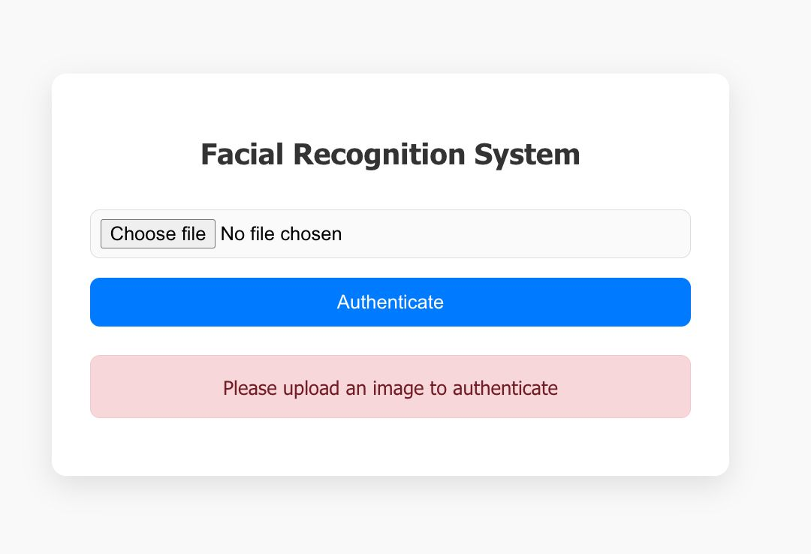
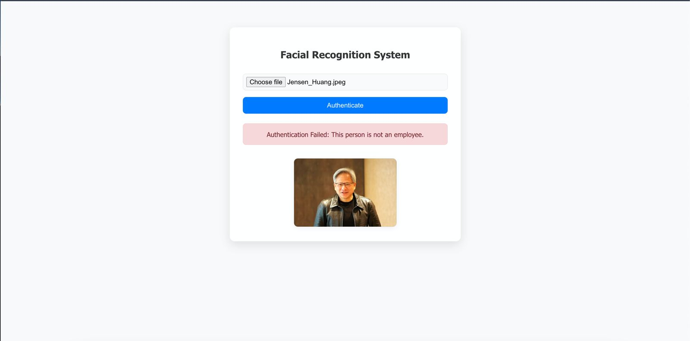

# Serverless Facial Recognition System using AWS

A fully serverless facial recognition system built on **AWS** that authenticates visitors by comparing their photos against a pre-registered employee database.  
The system uses **Amazon S3**, **AWS Lambda**, **Amazon Rekognition**, **Amazon DynamoDB**, and **Amazon API Gateway**, with a **React.js** frontend.

---

## 📌 Architecture


The system has two main flows:

1. **Admin Flow** – Admin uploads employee photos to an S3 bucket, triggering a Lambda function that:
   - Extracts employee metadata from the filename (`FirstName_LastName.jpeg`)
   - Indexes the face into Amazon Rekognition
   - Stores FaceId and employee details into DynamoDB

2. **Visitor Flow** – Visitors upload their photo via a React frontend, which:
   - Sends the image to S3 via API Gateway
   - Triggers a Lambda function to search for a match in Rekognition
   - Returns the employee details if matched

---

## 🛠 Services Used

- **Amazon S3** – Stores employee and visitor images  
- **AWS Lambda** – Handles backend processing for registration and authentication  
- **Amazon Rekognition** – Facial recognition and matching  
- **Amazon DynamoDB** – Stores employee metadata with Rekognition FaceId  
- **Amazon API Gateway** – Exposes endpoints for the frontend  
- **IAM** – Manages permissions securely  
- **React.js** – Frontend for visitor authentication

---

## 🚀 Features

- Fully serverless architecture
- Secure employee registration
- Real-time visitor authentication
- React.js user interface with image preview
- Scalable and cost-effective

---

## 📷 Screenshots

### System Architecture


### React Frontend


### Employee Recognized


### Employee Not Recognized


---

## 📦 Setup Instructions

### 1. Clone the Repository
```bash
git clone https://github.com/your-username/serverless-facial-recognition.git
cd serverless-facial-recognition
